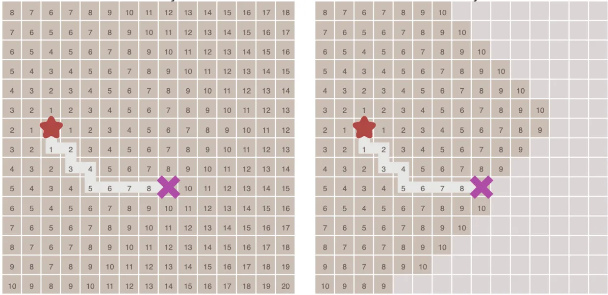
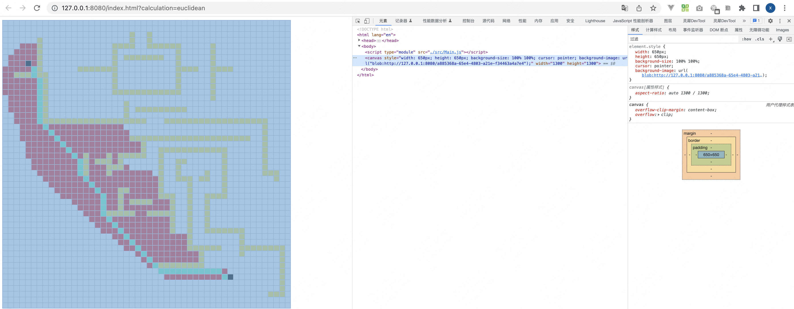
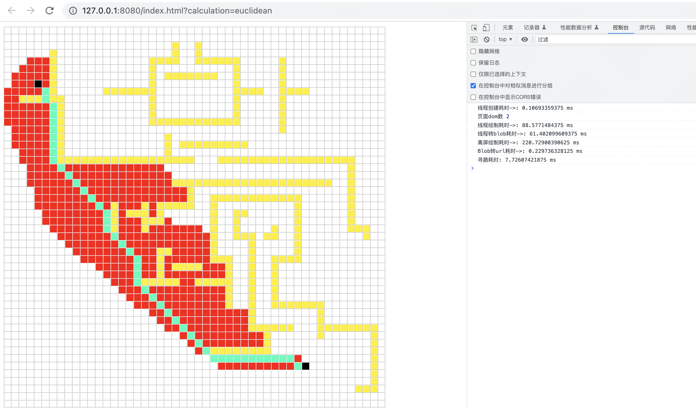

### 1 背景
通过一个寻路案例，逐步分解渲染、计算、算法三个维度推导过程、代码实现以及代码优化过程。
### 2 简介
* 广度优先搜索、Dijkstra和A*三种典型路径规划算法。它们都可用于图搜索，不同之处在于队列和启发式函数两个参数。
### 3 实现原理
* **BFS**
    * 先进先出队列实现BFS。从起点开始，首先遍历起点周围邻近的点，然后再遍历已经遍历过的点邻近的点，逐步的向外扩散，直到找到终点，算法遍历了图中所有的点，这通常没有必要。对于有明确终点的问题来说，一旦到达终点便可以提前终止算法。
    
* **Dijkstra**
    * 相比于BFS，Dijkstra最大的不同在于考虑了成本。通过该算法，可以根据节点到节点的成本找到最短路径。优先级队列使用数组实现，在每次插入新节点后对该数组进行排序。尽管实现优先级队列还有其他更高效的方式，但在我们的场景中，数组是足够快的，而且实现起来也简单。
    
* **A**
    * 实现A*算法，需要传递一个实际启发式函数，例如两个节点之间的欧式距离。通过“节点成本”+“节点到目标节点的估算成本”对节点进行加权，通过优先搜索更大可能的节点加快搜索速度。
    
### 4 渲染优化
* **多线程**
    * 为 JavaScript 创造多线程环境，允许主线程创建 Worker 线程，将一些任务分配给后者运行。在主线程运行的同时，Worker 线程在后台运行，两者互不干扰。等到 Worker 线程完成计算任务，再把结果返回给主线程。这样的好处是，一些计算密集型或高延迟的任务，被 Worker 线程负担了，主线程（通常负责 UI 交互）就会很流畅，不会被阻塞或拖慢。
* **离屏绘制**
    * OffscreenCanvas接口提供了一个可以在屏幕外渲染的画布，将 DOM 和Canvas API 解耦，使元素canvas不再完全依赖于 DOM。渲染操作也可以在工作上下文中运行，允许您在单独的线程中运行一些任务，避免在主线程上进行繁重的工作。OffscreenCanvas是一个[可转让的对象](https://developer.mozilla.org/en-US/docs/Web/API/Web_Workers_API/Transferable_objects)。
* **分层处理**
    * 动态绘制&静态绘制按需处理，减少绘制依赖（地图背景化）
### 5 启发算法
* **欧式距离**
    * 欧几里得度量（euclidean metric）（也称欧氏距离）是一个通常采用的距离定义，指在m维空间中两个点之间的真实距离，或者向量的自然长度（即该点到原点的距离）。 在二维和三维空间中的欧氏距离就是两点之间的实际距离。
* **曼哈顿距离**
   * 曼哈顿距离——两点在南北方向上的距离加上在东西方向上的距离，即d(i,j)=|xi-xj|+|yi-yj|。 对于一个具有正南正北、正东正西方向规则布局的城镇街道，从一点到达另一点的距离正是在南北方向上旅行的距离加上在东西方向上旅行的距离，因此，曼哈顿距离又称为出租车距离。
* **切比雪夫距离**
    * 在数学中，切比雪夫距离（Chebyshev distance）或是L∞度量，是向量空间中的一种度量，二个点之间的距离定义是其各坐标数值差绝对值的最大值。以数学的观点来看，切比雪夫距离是由一致范数（uniform norm）（或称为上确界范数）所衍生的度量，也是超凸度量（injective metric space）的一种。
### 4 工程命令
``` shell
cd algorithm/src/A-Star寻路
```


