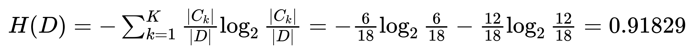

### 1 背景
你买了一个西瓜，它的特点是纹理是清晰，根蒂是硬挺的瓜，你如何快速判断是好瓜？还是坏瓜？恰好，大聪明给你构建了一颗决策树快速判断？

### 2 简介
* 决策树是一种从训练数据中学习得出一个树状结构进行判别的模型，决策过程就是从根结点开始，测试待分类项中对应的特征属性，并按照其值选择输出分支、直到叶子节点，最后将叶子节点的存放的类别作为决策结果。
* 决策树基本核心是贪心算法，自顶向下来构建一颗树，每一步选择中都采取在当前状态下最好的算法，在决策树生成过程中，属性选择度量是关键。

### 3 决策树算法之一（ID3算法）
ID3算法是一种贪心算法，用来构造决策树，以信息熵的下降速度为选取测试属性的标准，即在每个节点选取还尚未被用来划分的具有最高信息增益的属性作为划分标准，然后继续这个过程，直到生成的决策树能完美分类训练样例。
* **大致步骤**
    * 初始化属性特征集合和数据集合。
    * 计算数据集合**信息熵**和所有属性特征的**条件熵**，选择**信息增益**最大的特征作为当前决策节点。
    * 更新数据集合和特征集合（删除上一步使用的特征，并按照特征值来划分不同分支需要使用的数据集合）
    * 重复2、3两步，若子集值为单一特征，则为分支叶子节点
* **实战** 如果你是网球场馆经营人员，如何根据过往会员数据判断准备今天应该需要的资源。
    
* **名词**
    * 信息熵，如下图：
    * 按天气划分，如下图：
    * 条件熵（公式），如下图：
    * 按天气划分（条件熵），如下图：
    * 信息增益，如下图：
 * **效果**
    * 生成决策树 
    * **过拟合**，剪枝是一个简化过拟合决策树的过程（**先剪枝**、**后剪枝**）
        >算法决策树的每一个分支的深度，直到恰好能对训练样例完美地分类。然而这个策略并非总是行得通的，事实上，当数据中有噪声，或训练样例的数量太少以至于不能产生目标函数的有代表性的采样时，这个策略便会遇到困难。
### 4 ID3存在缺陷
* ID3算法也存在缺陷，ID3没有剪枝策略，容易过拟合；
* 信息增益对可取值数目较多的特征有所**偏好**，类似**编号**的特征其信息增益接近于1；
* 只能用于处理离散分布的特征，没有考虑缺失值。
### 5 其它决策算法
* Random Forest（**随机森林**）思想是**三个臭皮匠、赛过诸葛亮**。既然一棵树的**拟合能力**有限，那么就用多棵树**进行投票**
* **GBDT**与**随机森林**类似，也是用多棵树来**拟合**数据样本，但是，树与树之间是有依赖关系，每一棵树的构建都是基于前一棵树的结果。GBDT的设计思想是**站在前人的肩膀上看得更远**

