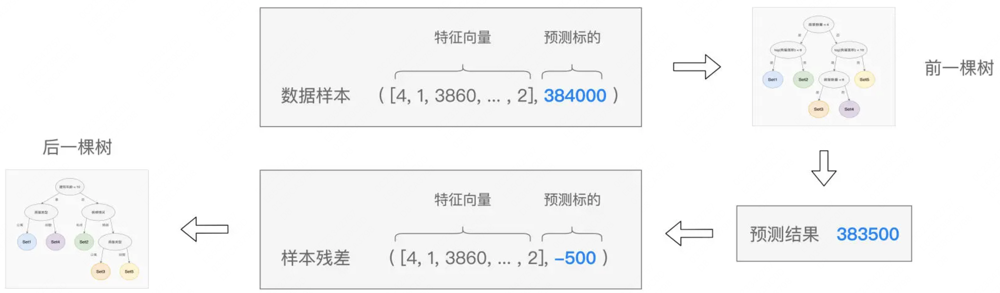

### 1 场景
你要买了一个西瓜，它的特点是纹理是清晰，根蒂是硬挺的瓜，如何快速判断是好瓜？还是坏瓜？恰好，大聪明的老板给你构建了一颗树帮你快速判断。

### 2 简介
* 决策树是一种从训练数据中学习得出一个树状结构进行判别的模型，决策过程就是从根结点开始，测试待分类项中对应的特征属性，并按照其值选择输出分支、直到叶子节点，最后将叶子节点的存放的类别作为决策结果，主要用于分类和回归任务的非参数监督学习。
* 决策树基本核心是贪心算法，自顶向下来构建一颗树，每一步选择中都采取在当前状态下最好的算法，在决策树生成过程中，属性选择度量是关键。

### 3 决策树算法之一ID3
ID3算法是一种贪心算法，用来构造决策树，以信息熵的下降速度为选取测试属性的标准，即在每个节点选取还尚未被用来划分的具有最高信息增益的属性作为划分标准，然后继续这个过程，直到生成的决策树能完美分类训练样例。
* **大致步骤**
    * 初始化属性特征集合和数据集合。
    * 计算数据集合**信息熵**和所有属性特征的**条件熵**，选择**信息增益**最大的特征作为当前决策节点。
    * 更新数据集合和特征集合（删除上一步使用的特征，并按照特征值来划分不同分支需要使用的数据集合）
    * 重复2、3两步，若子集值为单一特征，则为分支叶子节点
* **实战** 如果你是网球场馆经营人员，如何根据过往会员数据判断准备今天应该需要的资源。
    
* **名词** [数据公式编辑器](https://www.latexlive.com/)
    * 信息熵，是在信息的基础上，将有可能产生的信息定义为一个随机变量，变量的期望就是信息熵（ 0 和 1 之间）。熵是用来度量不确定性，熵越大则其不确定性越大，反之越小。
    * >例如：打网球的数据集为18天，6天不网球、12天打网球，将这些值代入公式求网球的所有属性信息熵为0.91829（信息熵越大，纯度越低。当集合中的所有样本均匀混合时，信息熵最大，纯度最低）
    
    * 按气温划分各属性信息熵，如下图：
    * 条件熵（公式），如下图：!
    * 按气温划分（热、温暖、凉爽、极寒四个条件的熵值），如下图：
    * 信息增益，如下图：注：信息增益表示拆分给定属性之前和之后的熵值差异主要用于目标分类。
    
 * **效果**
    * 生成决策树 
    * **过拟合**，剪枝是一个简化过拟合决策树的过程（**先剪枝**、**后剪枝**）
        >算法决策树的每一个分支的深度，直到恰好能对训练样例完美地分类。然而这个策略并非总是行得通的，事实上，当数据中有噪声，或训练样例的数量太少以至于不能产生目标函数的有代表性的采样时，这个策略便会遇到困难。
### 4 ID3优劣势
#### 优势
* 易于解释：决策树的逻辑和可视化表现有助于理解和使用，而分层结构也更易于发现最重要的属性。
* 几乎不需要数据准备：决策树具有许多特征，比其他分类方法更加灵活。它可以处理离散型或连续型等各种数据类型，并且连续值可通过使用阈值转换为分类值。 此外，它还可以处理具有缺失值的数据，但类似这种数据会给其他分类方法（如朴素贝叶斯算法）造成困难。
* 更加灵活：决策树可用于分类和回归任务，比其他一些算法更灵活。它对属性之间的潜在关系也不敏感；这意味着，如果两个变量的相关性极高，那么该算法只会选择其中一个特征来拆分
#### 劣势
* 容易过拟合：ID3算法也存在缺陷，ID3没有剪枝策略，容易过拟合；
* 预估器方差高：数据中的微小变化会产生非常不同的决策树。 可以使用Bagging算法降低决策树方差。
*  成本更高：决策树在构建过程中采用贪心搜索方法，其训练成本会高于其他算法
### 5 其它决策算法  [科普聊聊决策树模型](https://zhuanlan.zhihu.com/p/458010942)
* Random Forest（**随机森林**）思想是**三个臭皮匠、赛过诸葛亮**。既然一棵树的**拟合能力**有限，那么就用多棵树**进行投票**
* **GBDT**与**随机森林**类似，也是用多棵树来**拟合**数据样本，但是，树与树之间是有依赖关系，每一棵树的构建都是基于前一棵树的结果。GBDT的设计思想是**站在前人的肩膀上看得更远**

