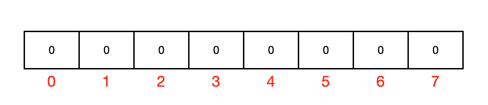
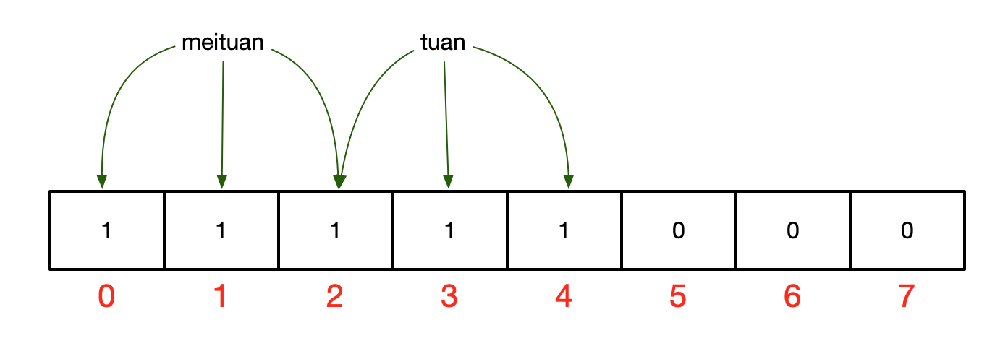
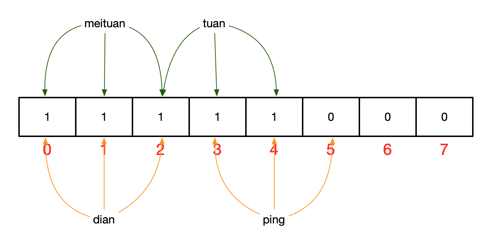
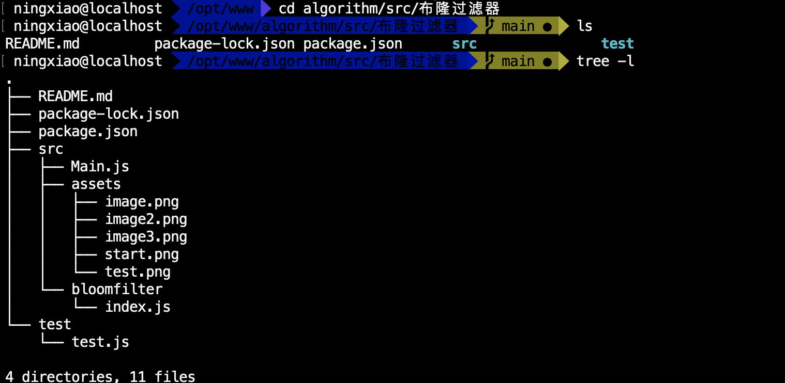
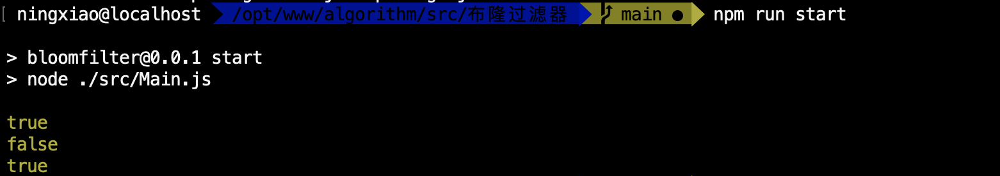
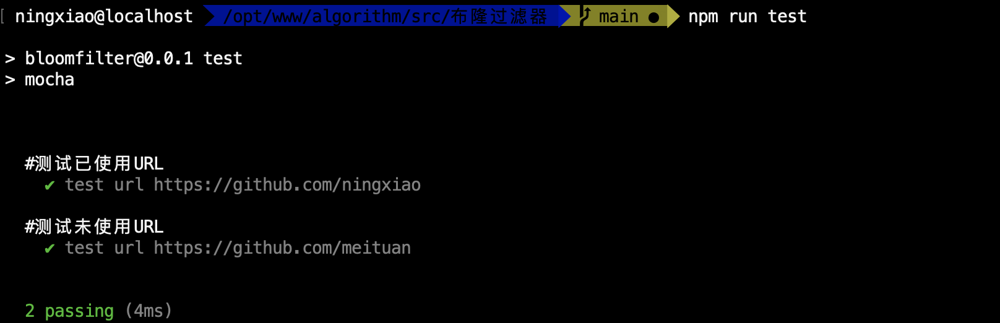

### 1 背景
假如我们数据库里保存了`meituan`、`tuan`但想要快速判断`dian`、 `ping`是否存在数据库中？
### 2 简介
* 布隆过滤器（Bloom Filter）它实际上是一个很长的二进制向量和一系列随机映射函数，布隆过滤器可以用于检索一个元素是否在一个集合中。
* 对比传统 List、Set、Map 等数据结构，它更高效、占用空间更少。但布隆过滤器可以检查值 **"可能存在集合中"** 或者 **"绝对不在集合中"**。而这个 **"可能"** 表示有一定的概率，也就是说它会一定的误判率。
### 3 实现原理
* **HashMap问题**
    * 讲述布隆过滤器的原理之前，我们先思考一下，通常你判断某个元素是否存在用的是什么？应该蛮多人回答 HashMap 吧，确实可以将值映射到 HashMap 的 Key，然后可以在 O(1) 的时间复杂度内返回结果，效率奇高。但是 HashMap 的实现也有缺点，例如存储容量占比高，考虑到负载因子的存在，通常空间是不能被用满的，而一旦你的值很多例如上亿的时候，那 HashMap 占据的内存大小就变得很可观了。
    * 还比如说你的数据集存储在远程服务器上，本地服务接受输入，而数据集非常大不可能一次性读进内存构建 HashMap 的时候，也会存在问题。
* **数据结构**
    * 布隆过滤器是一个 bit 向量或者说 bit 数组，如下图：

    * 如果我们要映射一个值到布隆过滤器中，我们需要使用**多个不同的哈希函数**生成**多个哈希值**，并对每个生成的哈希值指向的 bit 位置 1，首先我们将`meituan`使用三种不同的哈希函数，得到了哈希值0、1、2，存入布隆过滤器,再将`tuan`进行哈希，得到2，3，4，存入布隆过滤器，发现2重复，覆盖即可，则上图转变为：

    * 这时候计算`dian`，获得1、2、3，这时只能说明`dian`可能存在。再来计算`ping`，获得3、4、5发现5在布隆过滤器里对应的值是0，那么说明`ping`并不存在数据库中，我们可以看到`dian`的哈希值跟`meituan`、`tuan`有重合，所以随着存储数据越多，布隆过滤器中置为1的位更多，判断越不准确。

>这是为什么呢？答案跟简单，因为随着增加的值越来越多，被置为 1 的 bit 位也会越来越多，这样某个值 **douyin** 即使没有被存储过，但是万一哈希函数返回的三个 bit 位都被其他值置位了 1 ，那么程序还是会判断 **douyin** 这个值存在。
* **实现代码**
    ```javascript
    /**
    * 网络爬虫：URL去重策略之布隆过滤器算法
    * 默认数据 00000000000000000000
    *
    * 当我们对每个地址的每个字符哈希之后可以对应打入到每个点上
    * 对象A哈希值为 0，5，7     10000101000000000000
    * 对象B哈希值为 2，8，13    10100101100001000000
    * 对象C哈希值为 0，4，7     10101101100001000000
    * 其实就是将要对比的值哈希之后去比特数组里面对比是否每一位都是1如果是确定被使用过
    * 但是会存在部分误差数据 因为不同的元素经过哈希之后哈希值可能发生碰撞
    */
    class BitSet {
        #bitSize;
        #bitArray;
        /**
        * 生成比特数组赋值0
        * @param {*} bitSize 数组长度
        */
        constructor(bitSize) {
            this.#bitSize = bitSize;
            this.#bitArray = new Uint8Array(bitSize);
        };
        /**
        * 进行bit数据查找
        * @param {*} index 索引值
        * @param {*} value
        */
        set(index, value) {
            // 校验下标越界,也可以用this.#bitSize[index]!== undefined;
            if (index > -1 && index < this.#bitSize) {
                this.#bitArray[index] = value;
            };
        };
        /**
        * 判断当前bit位是否被占用
        * @param {*} index
        * @returns
        */
        get(index) {
            return this.#bitArray[index] === 1; // 被占用
        };
        get bitArray() {
            return this.#bitArray;
        }
        get size() {
            return this.#bitSize;
        };
    }
    class SimpleHash {
        #cap;
        #seed;
        /**
        * 一个简单的哈希函数
        * @param {*} cap
        * @param {*} seed
        */
        constructor(cap, seed) {
            //bitset容器
            this.#cap = cap;
            //哈希种子
            this.#seed = seed;
        };
        /**
        * hash函数，采用简单的加权和hash然后存入bit数组
        * @param {*} value
        * @returns 一个索引值
        */
        hash(value) {
            let result = 0;
            let size = value.length;
            for (let i = 0; i < size; i++) {
                // 取整 避免js精度问题出现
                result = parseInt(this.#seed * result + value.codePointAt(i));
            };
            /**
            * 避免产生越界存储 this.#cap
            * console.log(parseInt(23).toString(2),parseInt(12).toString(2),23&12,parseInt(4).toString(2));
            * 10111
            *  1100
            *   100 -> 4
            */
            return (this.#cap - 1) & result;
        };
    }
    class BloomFilter {
        #bitSet;
        #hashFuns = new Set();
        static DEFAULT_SIZE = 1 << 24; //按位左移操作符后30位置补全为了其实就是生产一个大数
        static SEED_LIST = [1, 3, 5, 7, 9, 11, 13, 15];        // 不同哈希函数的种子，一般应取质数
        constructor() {
            this.#bitSet = new BitSet(BloomFilter.DEFAULT_SIZE);
            // 生成8个哈希函数,同一个数据执行8次哈希并将结果存储在bit数组（8个数据）
            BloomFilter.SEED_LIST.forEach(seed => {
                this.#hashFuns.add(new SimpleHash(BloomFilter.DEFAULT_SIZE, seed));
            });
        };
        /**
        * 将字符串标记到bit数组中（进行8次哈希函数，降低误判率）
        * @param {*} value
        */
        add(value) {
            this.#hashFuns.forEach(f => {
                this.#bitSet.set(f.hash(value), 1);
            });
        };
        /**
        * 判断字符串是否已经被bit数组标记
        * @param {*} key
        */
        contains(key) {
            if (key) {
                let result = true;
                // 将8个哈希函数结果进行执行判断
                this.#hashFuns.forEach(f => {
                    result = result && this.#bitSet.get(f.hash(key));
                });
                return result;
            };
            return false;
        };
    }
    module.exports = BloomFilter;
    ```
    ```javascript
    const BloomFilter = require('./bloomfilter');
    const bloomFilter = new BloomFilter();
    [
        'https://github.com/ningxiao',
        'https://github.com/liming',
        'https://github.com/zhangsan',
        'https://github.com/wangmaiz',
        'https://github.com/liergou'
    ].forEach(url => bloomFilter.add(url));
    bloomFilter.contains();
    console.log(bloomFilter.contains('https://github.com/ningxiao'));
    console.log(bloomFilter.contains('https://github.com/meituan'));
    console.log(bloomFilter.contains('https://github.com/ningxiao'));
    ```
### 4 工程命令
``` shell
cd algorithm/src/布隆过滤器
```

**🛠️ 执行运行 `npm run start`**

**🔬 Test in BloomFilter `npm run test`**

### 5 Cellar应用
* 网页爬虫对URL去重，避免爬取相同的URL地址
* 反垃圾邮件，从数十亿个垃圾邮件列表中判断某邮箱是否垃圾邮箱
* Google Chrome 使用布隆过滤器识别恶意URL
* 解决数据缓存穿透的问题(减少直接访问数据库)
    >所谓的缓存穿透就是服务调用方每次都是查询不在缓存中的数据，这样每次服务调用都会到数据库中进行查询，如果这类请求比较多的话，就会导致数据库压力增大，这样缓存就失去了意义。


